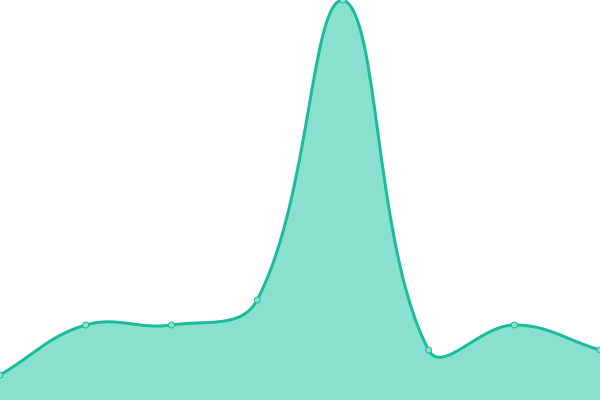

# [📈 Live Status](https://MysterAitch.github.io/monitor-gias): <!--live status--> **🟥 Complete outage**

This repository contains the open-source uptime monitor and status page for [Roger Howell](https://MysterAitch.github.io/monitor-gias), powered by [Upptime](https://github.com/upptime/upptime).

With [Upptime](https://upptime.js.org), you can get your own unlimited and free uptime monitor and status page, powered entirely by a GitHub repository. We use [Issues](https://github.com/MysterAitch/monitor-gias/issues) as incident reports, [Actions](https://github.com/MysterAitch/monitor-gias/actions) as uptime monitors, and [Pages](https://MysterAitch.github.io/monitor-gias) for the status page.

<!--start: status pages-->
<!-- This summary is generated by Upptime (https://github.com/upptime/upptime) -->
<!-- Do not edit this manually, your changes will be overwritten -->
<!-- prettier-ignore -->
| URL | Status | History | Response Time | Uptime |
| --- | ------ | ------- | ------------- | ------ |
|  [GIAS Home Page](https://get-information-schools.service.gov.uk/) | 🟥 Down | [gias-home-page.yml](https://github.com/MysterAitch/monitor-gias/commits/HEAD/history/gias-home-page.yml) | 

 1022ms
     
 | 

<a href="https://MysterAitch.github.io/monitor-gias/history/gias-home-page">99.73%</a>
    

|  [GIAS Home Page (`www.`)](https://www.get-information-schools.service.gov.uk/) | 🟥 Down | [gias-home-page-www.yml](https://github.com/MysterAitch/monitor-gias/commits/HEAD/history/gias-home-page-www.yml) | 

 982ms
     
 | 

<a href="https://MysterAitch.github.io/monitor-gias/history/gias-home-page-www">99.73%</a>
    

|  [GIAS Downloads Page](https://www.get-information-schools.service.gov.uk/Downloads) | 🟥 Down | [gias-downloads-page.yml](https://github.com/MysterAitch/monitor-gias/commits/HEAD/history/gias-downloads-page.yml) | 

 4441ms
     
 | 

<a href="https://MysterAitch.github.io/monitor-gias/history/gias-downloads-page">99.73%</a>
    

<!--end: status pages-->

[**Visit our status website →**](https://MysterAitch.github.io/monitor-gias)

## 📄 License

- Powered by: [Upptime](https://github.com/upptime/upptime)
- Code: [MIT](./LICENSE) © [Roger Howell](https://MysterAitch.github.io/monitor-gias)
- Data in the `./history` directory: [Open Database License](https://opendatacommons.org/licenses/odbl/1-0/)
